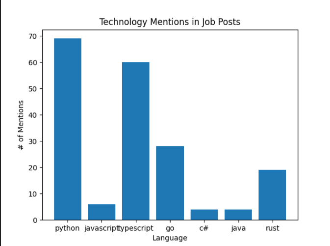

# 🕵️‍♂️ Tech Mention Scraper

This Python script scrapes comments from a [Hacker News](https://news.ycombinator.com/item?id=42919502) discussion thread and analyzes how often certain programming languages are mentioned. The results are visualized in a bar chart.

---

## 📌 Features

- Scrapes top-level comments from a Hacker News post
- Counts mentions of selected programming languages
- Cleans and processes text to improve accuracy
- Displays results in a bar chart using `matplotlib`

---

## 🛠️ Technologies Used

- `requests` – for HTTP requests  
- `BeautifulSoup` – for parsing HTML  
- `matplotlib` – for data visualization

---

## 📦 Installation

1. **Clone this repository:**
   ```bash
   git clone https://github.com/MaizaAymen/Web-Scraping.git
   cd WEB-SCRAPING
